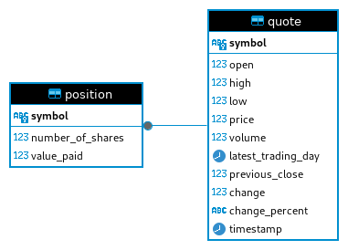

# Introduction

The Stock Quote application is a command-line tool designed to manage a virtual stock portfolio. It fetches real-time stock data via the Alpha Vantage API and stores it in a PostgreSQL database using JDBC. The project is built with Maven for dependency management and Docker for containerization, ensuring seamless deployment and portability. The application leverages Java 21 for its development, incorporating advanced features and libraries to handle data efficiently.

# Implementation

The application is built using Java 21, leveraging its latest features for enhanced performance and reliability. The project uses the Jackson Databind library for efficient serialization and deserialization of stock data obtained from the Alpha Vantage API. Maven manages the project's dependencies, including JUnit for testing, Mockito for mocking, SLF4J for logging, and LOG4j for advanced logging capabilities. The application adheres to standard JDBC practices and is organized into Data Access Objects (DAOs), Services, and Controllers to maintain a clear separation of concerns.

## ER Diagram

## Design Patterns

The application implements both the Data Access Object (DAO) and Repository design patterns. The DAO pattern is used to separate the data access logic from the business logic, encapsulating all database interactions within dedicated DAO classes. This promotes modularity and maintainability by isolating data access concerns from the core business logic. The Repository pattern provides an abstraction layer that simplifies the interaction with data sources, allowing the application to operate with business domain objects rather than direct database operations. This approach enhances testability and flexibility by enabling the use of mock repositories in unit tests and supporting easier updates to the data access layer.

# Test

Testing is conducted using JUnit and Mockito to ensure the application's functionality against the PostgreSQL database. Test data is inserted into the database and transformed to simulate various scenarios, verifying the applications operations using assertions and verifications. CRUD operations are thoroughly tested to confirm correct database interactions. Mockito is used to simulate external dependencies, allowing for isolated unit tests. Integration tests validate end-to-end functionality, including the interaction between different components and layers of the application, ensuring comprehensive coverage and reliability.
